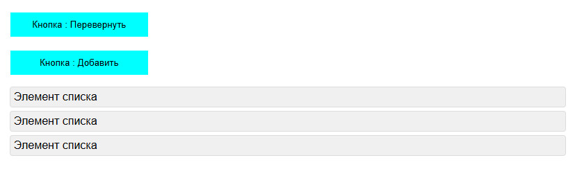

# Фреймворк Vue.js. Обучение в записи

# Урок 2. Семинар: Введение в Vue.js
## Часть 1: Работа с макетом

  

По заданному макету в приложенных файлах создать верстку главной страницы (без использования vue).

 

 

#### Задание по работе с макетом направлено на подготовку проекта к итоговой аттестации.

 
 

## Часть 2. Задание по Vue

1. Создать кнопку "Перевернуть". При клике на кнопку текст кнопки, должен перевернуться и отобразиться в обратном порядке.

2. Есть список элементов.  Пользователь может добавлять новые элементы списка с текстом “Новый элемент списка” нажав на кнопку "Добавить".
     
3. *Дополнительное задание: При клике на элемент списка он должен быть удален. (по желанию)
  

 

#### Формат сдачи: ссылка на гитхаб.